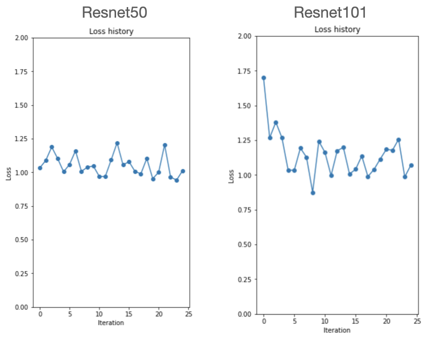

# Diabetes-retina-detection

# Introduction
당뇨는 성인 인구의 8.8%를 차지하고 있는 흔한 질병이고 당뇨가 있는 경우 당뇨 망막 병증을 1년에 한번씩 검사를 받아야 합니다. 따라서 이를 검사하여 증상을 잡아내는 과정을 AI 모델로 대체할 수 있다면 환자와 의료 인력 모두에 좋을 것입니다. 이에 모델을 직접 구현한다면 좋은 경험이 될 것이라 생각했습니다.

환자의 망막 이미지와 질병 level 정도에는 유의미한 상관관계가 존재합니다. 이러한 상관관계에 기반하여 자동화 분류 모델을 구축하면, 새로운 환자의 망막 이미지가 데이터로 들어왔을 때, 구축한 자동화 분류기를 이용해 환자가 병의 level을 추측하고 질병의 증세의 정도를 판단하여 환자와 의료 기관 양 측의 시간과 인력, 비용을 절감하는 효과가 있습니다.

# Data
본 프로젝트는 캐글의 https://www.kaggle.com/c/diabetic-retinopathy-detection/data 의 데이터셋을 사용합니다.

### data information
각 이미지 데이터들은 0에서 4까지 5개의 레벨 값을 갖고 있습니다. 레벨 0은 6149개, 1은 588개, 2는 1283개, 3은 221개, 4는 166개의 데이터가 존재합니다.

### Pre process

1. image resize
이미지 데이터가 매우 크기 때문에 계산 비용 절감을 위해 128x128 사이즈로 축소시킵니다.

2. 이미지 crop, blur check
이미지 중 color space가 존재하지 않아서 train으로 적절치 못한 이미지를 제거합니다.
또한 이미지 데이터의 blur정도를 계산하여 역시 적절치 못한 이미지를 drop시킵니다.

3. 이미지 rotate / mirror
이미지를 좌우반전시키고, 클래스 1~4에 속하는 이미지들은 추가적으로 90, 120,180,270 도로 회전시켜 이미지를 강화시킵니다.

# Model
- Adam optimizer
- Cross Entropy loss

### CNN
1. shallow model

shallow 모델에서의 성능을 파악하기 위해 learning rate를 10^(-2)로 설정한 2 layer convolution 모델을 만들었습니다. input과 output의 dimension을 그대로 128*128로 유지하도록 첫 레이어에서 kernel을 5, stride 1, padding을 2로 줬습니다. 두번째 레이어의 kernel을 3, stride 1, padding을 1로 설정했습니다. convolution 레이어 하나를 쌓을 때마다 batch normalization을 적용해 regularization을 주었고, ReLU를 적용한 비선형 변환을 했습니다. epoch 10으로 validation dataset에서의 성능을 계산해본 결과 최대 55.5%의 정확도를 얻을 수 있었고, test set에서도 56.7%로 비슷한 정확도를 보였습니다.

2. deeper model

모델의 성능을 끌어올리고자 learning rate를 10^(-1), 10^(-4), 2*10^(-2)등으로 조절하고, batch size도 16으로 적용해보며 성능 변화를 관찰해보았고, learning rate를 2*10^(-3), batch size를 16으로 설정했을 때 validation dataset과 test set에서의 정확도가 60%까지 높아질 수 있다는 것을 확인했습니다.

3. AlexNet model

learning rate=2e-3, batch size=16으로 설정해 AlexNet 모델을 fine tuning한 더 깊은 모델을 데이터에 적용해 성능을 더 끌어올리고자 했습니다. 하지만 레이어를 깊게 쌓았을 때 fully connected layer를 둘 이상 쌓을 경우 정확도가 47.6%로 계속 동일하게 나오는 현상을 발견했고, AlexNet의 윗단 Fully connected layer를 뺀 convolution layer와 Maxpooling을 반복적으로 쌓아 모델을 완성했습니다. 구축된 모델로 성능 평가를 수행해본 결과 61.6%까지 성능을 올릴 수 있었지만, 유의미한 변화라고 판단할 수 없었기 때문에 다른 모델을 시도해보고자 ResNet 모델을 사용했습니다.

### ResNet

resnet50과 101을 구현하여 성능을 더 끌어올리려는 시도했습니다.
Resnet의 bottleneck부분은 conv->batchnorm->activation function인 relu를 세번 쌓은 구조를 가지고 있습니다. 3x3 layer 2개를 연결하면 연산량이 많아지므로 1x1 layer로 채널(차원)을 4분의 1로 줄이고 3x3 layer를 실행한 뒤 다시 1x1 layer로 채널을 4배 늘려주었습니다.
그리고 layer을 4개 쌓아주는데, resnet50은 layer마다 bottleneck의 개수가 각각 3,4,6,3개이고 resnet101은 layer 마다  bottleneck의 개수가 각각 3,4,23,3개 입니다. 
레이어 과정이 다 끝나면 이를 average pool 시키고 fully connected과정을 거쳐서 클래스를 도출합니다.

Batch size/ learning rate/optrimizer 종류/iteration 등의 파라미터를 조정하면서 train시켜 정확도를 높이고자 했습니다. 
그 결과로 epoch=10, learning rate=2e-3일때 batch size=64일때 resnet50은 test set의 정확도가 60%, resnet101은 59%의 정확도를 보였습니다.

# Conclusion
모든 모델에서 60% 정도의 정확도를 보였고, 이의 원인에 대한 생각과 발전 방향입니다..
1. 고 해상도 망막 데이터를 128x128 픽셀로 downsize하면서 trivial한 특징(안구의 반점, 핏줄 등) 정보가 제대로 반영되지 않음. 

2. 이미지마다 밝기와 이미지내 망막위치가 모두 달라서 noise를 처리하는데에 한계 존재. 따라서 train데이터와 validation 데이터의 정확도가 상당히 비슷하게 나타남.

3. class imbalance 문제를 해결하기 위하여 rotate/mirror시키는 방식으로 이미지들을 복사 시켰는데, 이들의 이미지 feature들이 비슷해져서 accuracy도 비슷하게 나타남.

따라서 이미지들의 밝기를 일정하게 조절하여 노이즈를 처리하고, Downsize한 이미지로 train시키고 다시 확장시켜 retrain해여 downsize로 인한 문제점들을 완화할 수 있을 것이라 생각합니다. 추가적으로 class imbalance 문제를 제거하기 위하여 class 1부터 class 4에 해당하는 데이터들을 하나로 묶어 단순 병의 존재 유무만을 판정하는 모델도 유의미할 것 입니다.

